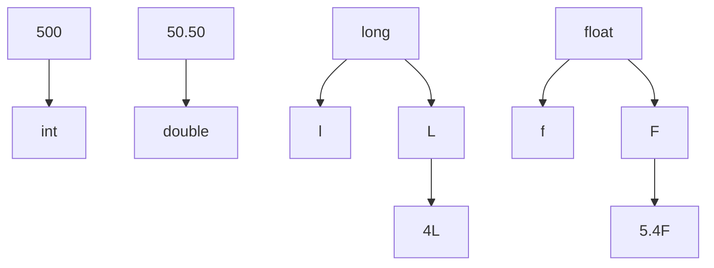
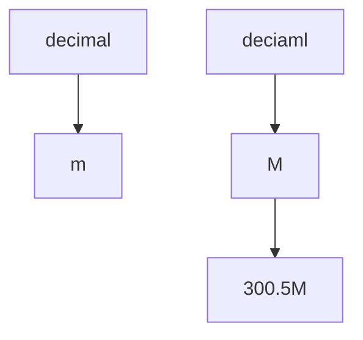

we could use the `foreach loop` too. 

`GetCommandLineArgs()` is a method of the `System.Environment` type to access command line arguments, the return value is an array of strings.

```csharp
// Get arguments using System.Environment.
string[] theArgs = Environment.GetCommandLineArgs();
foreach(string arg in theArgs) {
	Console.WriteLine("Arg: {0}", arg);
}
Console.ReadLine();
return 0;
```

> there is a `System.Environement` class that offers many methods to help retrieve system informations. 

> `WriteLine()` pumps a string with carriage return to the output stream, `Write` does it also but without carriage return.

> `ReadLine()` allows you to receive information from the input stream up  until the Enter key is pressed, while `Read()` is used to 
   capture a single character from the input stream.

------ 
below is a way to play with the console :

```csharp
using System;

Console.WriteLine("***** Basic Console I/O *****");
GetUserData();
Console.ReadLine();


static void GetUserData() {

// Get name and age.
Console.Write("Please enter your name: ");
string userName = Console.ReadLine();
Console.Write("Please enter your age: ");
string userAge = Console.ReadLine();

// Change echo color, just for fun.

ConsoleColor prevColor = Console.ForegroundColor;
Console.ForegroundColor = ConsoleColor.Yellow;

// Echo to the console.

Console.WriteLine("Hello {0}! You are {1} years old.",
userName, userAge);

// Restore previous color.

Console.ForegroundColor = prevColor;

}
```

### Formatting numbers 

![[Screenshot 2024-09-20 at 21.19.17.png]]

```csharp
class Program
{
    public static void Main(string[] args)
    {
        FormatNumericalData();
    }

    static void FormatNumericalData()
    {
        Console.WriteLine("The value 99999 in various formats:");
        Console.WriteLine("c format: {0:c}", 99999);

        Console.WriteLine("d9 format: {0:d9}", 99999);
        Console.WriteLine("f3 format: {0:f3}", 99999);
        Console.WriteLine("n format: {0:n}", 99999);
        // Notice that upper- or lowercasing for hex
        // determines if letters are upper- or lowercase.
        Console.WriteLine("E format: {0:E}", 99999);
        Console.WriteLine("e format: {0:e}", 99999);
        Console.WriteLine("X format: {0:X}", 99999);
        Console.WriteLine("x format: {0:x}", 99999);
    }
}
```

### The default literal 

It assigns a variable the default value for it's data type. this works for standard data types, custom classes and generic types.

### Using intrinsic data types and the new operator 

All intrinsic data types support a default constructor using the `new` keyword which sets these variables to their default value. 

- bools are set to false.
- ints are set to $0$ and floating points are set to $0.0$. 
- chars are set to a single empty character. 

```csharp
static void NewingDataTypes()
{
Console.WriteLine("=> Using new to create variables:");
bool b = new bool(); // Set to false.
int i = new int(); // Set to 0.
double d = new double(); // Set to 0.
DateTime dt = new DateTime(); // Set to 1/1/0001 12:00:00 AM
Console.WriteLine("{0}, {1}, {2}, {3}", b, i, d, dt);
Console.WriteLine();
}
```

> C# 9.0 adds a shortcut for creating variable instances. This shortcut is simply using the keyword new() without the data type. The updated version of NewingDataTypes is shown below

```csharp
static void NewingDataTypesWith9()
{
Console.WriteLine("=> Using new to create variables:");
bool b = new(); // Set to false.
int i = new(); // Set to 0.
double d = new(); // Set to 0.
DateTime dt = new(); // Set to 1/1/0001 12:00:00 AM
Console.WriteLine("{0}, {1}, {2}, {3}", b, i, d, dt);
Console.WriteLine();
}
```



> In C#, **members** refer to the elements that define the structure and behavior of a class, struct, interface, or other types. Members can be: 
> 
>  1. **Fields**: Variables that hold data for the object (instance variables) or the class (static variables). 
> 2. **Properties**: Accessors that provide controlled access to fields.
> 3. **Methods**: Functions or actions that an object or class can perform.
> 4. **Constructors**: Special methods used to initialize objects.
> 5. **Events**: Notifications or signals that the object can send when something happens.
> 6. **Indexers**: Allow objects to be indexed like arrays.
> 7. **Operators**: Special methods that define how operators work with objects of the class (e.g., `+`, `-`).
> 8. **Delegates**: References to methods that can be passed around and invoked.
> 9. **Nested Types**: Classes, structs, enums, or other types defined within a class.
> These members collectively define the capabilities and state of a class or struct.s


### Parsing values from string data 

> Parsing string data is helpful to convert string data to numerical values. 

```cs
static void ParseFromStrings()
{
Console.WriteLine("=> Data type parsing:");
bool b = bool.Parse("True");
Console.WriteLine("Value of b: {0}", b);
double d = double.Parse("99.884");
Console.WriteLine("Value of d: {0}", d);
int i = int.Parse("8");
Console.WriteLine("Value of i: {0}", i);
char c = Char.Parse("w");
Console.WriteLine("Value of c: {0}", c);
Console.WriteLine();
}
```


> [!NOTE] tryParse 
>  the `tryParse()`  method returns a `bool` if the parsing was successful, and it takes an `out` parameter. 

```cs
//Parsing in unsuccessful, so b is false here.
// that's because we cannot convert a string to a bool.

if (bool.TryParse("hello", out bool b))
{
	Console.WriteLine("Value of b: {0}", b);
}
else
{
	Console.WriteLine("Default value of b: {0}", b);
}

//Parsing here is successful, so be is true.
// True is a bool here btw.
if (bool.TryParse("True" /*False*/, out bool b))
{
	Console.WriteLine("Value of b: {0}", b);
}
else
{
	Console.WriteLine("Default value of b: {0}", b);
}
```


another example : 

```cs
string value = "hi";

if (double.TryParse(value, out double d))
{
	Console.WriteLine("value of d:{0}", d);
}
else
{
	Console.WriteLine("Failed to convert the input {0} to a double and  the variable was assigned the default {1}", value, d);
}
	Console.WriteLine();
```

> _ can be used as a digit separator.

About escape characters, used to format the output stream. Each escape character begins with a backslash. 

![[Screenshot 2024-10-14 at 20.27.23.png]]


> [!NOTE] string interpolation 
> `string greeting2 = $"\tHello {name.ToUpper()} you are {age} years old.";`

we use verbatim strings (updated 8.0) to disable the processing of a literal's escape characters and print out a string as it is, this is useful when working with strings representing directories and network paths etc. 


> [!NOTE] verbatim strings
>  every string started with @ is a verbatim string. 
`Console.WriteLine(@"C:\MyApp\bin\Debug");`
> in this line all the escapes are printed. 
>  - verbatim strings can be interpolated strings.

### Equality of strings 

> a reference type is an object allocated on the garbage-collected managed heap.

so by default when performing an equality test on reference types, true will be returned as a result if the refs are pointing to the same object in memory. But, even though string is a reference type, the equality operators have been redefined to compare the values of string objects, not the object in memory to which they refer. 

```csharp
string s1 = "Hello!";
string s2 = "Yo!";

Console.WriteLine("s1 = {0}", s1); // Hello
Console.WriteLine("s2 = {0}", s2); // Yo

Console.WriteLine();

Console.WriteLine("s1 == s2: {0}", s1 == s2); // F
Console.WriteLine("s1 == Hello!: {0}", s1 == "Hello!"); // T
Console.WriteLine("s1 == HELLO!: {0}", s1 == "HELLO!"); // F
Console.WriteLine("s1 == hello!: {0}", s1 == "hello!"); // F
Console.WriteLine("s1.Equals(s2): {0}", s1.Equals(s2)); // F
Console.WriteLine("Yo!.Equals(s2): {0}", "Yo!".Equals(s2)); // T
Console.WriteLine();
```

> a declared string is actually an instance of the object System.String;

### System.Text.StringBuilder 

```c#
// StringBuilder lives here 
using System.Text;
```

> What is unique about the StringBuilder is that when you call members of this type, you are directly modifying the object’s internal character data (making it more efficient), not obtaining a copy of the data in a modified format.

This is the huge difference between using StringBuilder and StringObjects. 

```c#
Console.WriteLine("=> Using the StringBuilder:");
StringBuilder sb = new StringBuilder("**** Fantastic Games ****");
sb.Append("\n");
sb.AppendLine("Half Life");
sb.AppendLine("Morrowind");
sb.AppendLine("Deus Ex" + "2");
sb.AppendLine("System Shock");
Console.WriteLine(sb.ToString());
sb.Replace("2", " Invisible War");
Console.WriteLine(sb.ToString());
Console.WriteLine("sb has {0} chars.", sb.Length);
Console.WriteLine();
```

output :

```terminal
=> Using the StringBuilder:
**** Fantastic Games ****
Half Life
Morrowind
Deus Ex2
System Shock

**** Fantastic Games ****
Half Life
Morrowind
Deus Ex Invisible War
System Shock

sb has 81 chars.
```

StringBuilder is able to only hold initially a string of 16 characters or fewer but it can expand automatically if necessary, to change this behaviour  i must add add another argument to the constructor. 

```c#
// Make a StringBuilder with an initial size of 256.
StringBuilder sb = new StringBuilder("**** Fantastic Games ****", 256);
```

## Loops 

- for.
- foreach/in.
- while.
- do/while.

### Using Implicit Typing Within foreach Constructs 

#remember_to_read_about_it

do/while is used when I need to perform an action for undetermined number of times, the loop is guaranteed to run the code at least once compared to while loop that might never run the code if the terminating condition is false from the onset. 

> 0 and 1 to check the truth of an expression is not valid for c# unlike c/cpp. 

### if/else with pattern matching 

```c#
object testItem1 = 123;
object testItem2 = "Hello";

if (testItem1 is string myStringValue1)
{
	Console.WriteLine($"{myStringValue1} is a string");
}

if (testItem1 is int myValue1)
{
	Console.WriteLine($"{myValue1} is an int");
}

if (testItem2 is string myStringValue2)
{
	Console.WriteLine($"{myStringValue2} is a string");
}

if (testItem2 is int myValue2)
{
	Console.WriteLine($"{myValue2} is an int");
}

Console.WriteLine();
```

### Pattern matching improvements (9.0)

- check if a variable is Type.
- parenthesized patterns.
- conjuctive patterns (and).
- disjunctive patterns (or).
- negated patters (not).
- relational patterns.

```csharp
static void IfElsePatternMatchingUpdatedInCSharp9()
{
    object testItem1 = 123;
    Type t = typeof(string);
    char c = 'f';

    // Type patterns
    if (t is Type)
    {
        Console.WriteLine($"{t} is a Type");
    }

    // Relational, Conjunctive, and Disjunctive patterns
    if (c is >= 'a' and <= 'z' or >= 'A' and <= 'Z')
    {
        Console.WriteLine($"{c} is a character");
    }

    // Parenthesized patterns
    if (c is (>= 'a' and <= 'z') or (>= 'A' and <= 'Z') or '.' or ',')
    {
        Console.WriteLine($"{c} is a character or separator");
    }

    // Negative patterns
    if (testItem1 is not string)
    {
        Console.WriteLine($"{testItem1} is not a string");
    }

    if (testItem1 is not null)
    {
        Console.WriteLine($"{testItem1} is not null");
    }

    Console.WriteLine();
}
```

> && and || both short-circuit when necessary, if i want all expressions to be checked then i must use & or |. 

## Switch 

The switch statement is similar to java, but with some different points. 

> C# can evaluate char, string, bool, int, long, and enum data types. 

therefore we can also switch an enum type ! (More about that on page 103 - 155 of 1,383).

### Implicitly typed local arrays 

_There is a section about implicitly typed local variables, check that out !_

```cs
var c = new[] { "hello", null, "world" };
Console.WriteLine("c is a: {0}", c.ToString());
```

Here, the output is `c is a: System.String[]`.

- all ints, all strings or all x. 
- An implicitly typed local array does not default to System.Object. 

### Defining an array of objects 

We can define an array of `System.Object` data types where the subitems could be anything ay all.

```cs
object[] myObjects = new object[4];
myObjects[0] = 1;
myObjects[1] = false;
myObjects[2] = new DateTime(1969, 3, 24);
myObjects[3] = "FUCKING VOID";

foreach (object obj in myObjects)
{
    Console.WriteLine("Type: {0}, Value: {1}", obj.GetType(), obj);
}
```

### Multidimensional array 

A way to express matrices or just arrays with different dimensions. We have the multidimensional rectangular array that looks like this : 

```cs
// a rect array

int[,] matrix;

matrix = new int[3, 4];

// populate the 3*4 array.
for (int i = 0; i < 3; i++)
{
	for (int j = 0; j < 4; j++)
	{
	matrix[i, j] = i * j;
	}
}

//print the 3*4 array
for (int i = 0; i < 3; i++)
{
	for (int j = 0; j < 4; j++)
	{
		Console.Write(matrix[i, j] + "\t");
	}
	Console.WriteLine();
}
```

### Jagged arrays _(i.e., an array of arrays)_

> We define the length of the jagged array which is 5 arrays, then creating the jagged array by defining each array with it's own length and type. To print out the result we iterate through the jagged array (has 5 arrays) and then we iterate each array one by one and print out the ith array of the arrays with each array one by one.

```cs
// Create a jagged multidimensional array
int[][] myJagArray = new int[5][]; // an array of 5 different arrays.

// Initialize each sub-array in the jagged array
for (int i = 0; i < myJagArray.Length; i++)
{
    myJagArray[i] = new int[i + 7]; // each sub-array has a size of i + 7
}

// Print each row (default values are 0)
for (int i = 0; i < 5; i++)
{
    for (int j = 0; j < myJagArray[i].Length; j++)
    {
        Console.Write(myJagArray[i][j] + " "); // print each element in the row
    }
    Console.WriteLine(); // new line for each row
}

```

### Using arrays as arguments or return values 

This code explains itself.

```cs
static void PrintArray(int[] myInts)
{
    for (int i = 0; i < myInts.Length; i++)
    {
        Console.WriteLine("item {0} is {1}", i, myInts[i]);
    }
}

static string[] GetStringArray()
{
    string[] theStrings = { "hello", "from", "china" };
    return theStrings;
}

static void PassAndReceiveArrays()
{
    // pass an array as a param
    int[] numbers = { 1, 2, 3 };
    PrintArray(numbers);

    // get an array as a return value 
    string[] strs = GetStringArray();
    foreach (string s in strs)
    {
        Console.Write(s + " ");
    }
}

```

> arrays gather most of their functionality from the `System.Array` class, therefore there are many members (some of them to be called methods) to use on arrays.

some of the members : 
- Clear()
- CopyTo()
- Length
- Rank
- Reverse()
- Sort()

More about these members on the official documentation. 

Many members of the System.Array are defined as static members and are called at the class level _(Array.Sort(myArr) for eg.)_, other members such as Length property are bound at the object level thus we can invoke the member directly on the array 
_(myArr.Length for eg)_.


> [!NOTE] Indices and Ranges
> - `System.Index` represents an index into a seq.
> - `System.Range` represents a subrange of indices.

The code below covers everything :

```cs
int[] ints = { 1, 2, 3, 4, 5, 6, 7, 8 };

for (int i = 1; i <= ints.Length; i++)
{
    Index index = ^i;
    Console.Write(ints[index] + "-");
}
Console.WriteLine("\n");

// range 
//foreach (var itm in ints[0..2])
//{
//  Console.Write(itm + ", ");
//}

Range r = 0..2;
// 0 is inclusive and 2 is exclusive 
foreach (var item in ints[r])
{
    Console.Write(item + ", ");
}

```

> If the beginning of the range is left off, the beginning of the sequence is used. If the end of the range is left off, the length of the range is used. This does not cause an error, since the value at the end of the range is exclusive. For the previous example of three items in an array, all the ranges represent the same subset.

```cs
ints[..]
ints[0..^0]
ints[0..3]
```

### Methods 

> Methods that returns a value to the caller are referred to as a function, while methods that do not return a value are referred to as methods. 

- Access modifiers (coming).
- Method parameters (covered in this section).


> [!NOTE] Static methods 
> A static method belongs to a class and not to an instance of that class, here are some key points about methods : 
> - Static methods cannot access instance variables or instance methods directly, they can only access static variables and other static methods within the class.
> - Static methods are often used for utility or helper functions that don't require any data from an instance of the class. For example, a method that performs a calculation or a function that converts one data type to another can be static.
> - Since static methods are associated with the class itself, they are stored in the memory only once, making them more memory-efficient when you don't need to create multiple instances of a class.

### Local functions 

Methods within methods, referred to as _local functions_. 
- function declared inside another function.
- must be private, with c#8.0 it can be static. 
- does not support overloading. 
- does support nesting, a local function inside another local function.

### Method parameters, understanding method parameter modifiers 

The default way a parameter is sent into function is by value, this means that the function receives a copy of the value, any changes made to the parameter inside the function does affect the original value outside of the function. 

```cs
int n = 5;

void change(int n)
{
	n++;
} 
change(n);
Console.WriteLine(n); // n = 5
```

We can use some methods to control how a parameter is passed to a method, either we want it to be passed by value or by reference. 

- None : if no modifier is used then the parameter is assumed passed by value, reference types without a modifier will passed by reference. 
- out : allows a method to return multiple values by passing parameters by reference, when using out, the method can assign a value to the out parameter which will be reflected in the calling code. This is useful if you need to return more than one value from the method. 
```cs
static void calculate(int a, int b, out int result){
	result = a+b;
}
int result;
calculate(1,1,out result);
```

#### key points 

- **Assignment Required**: The method must assign a value to `out` parameters before it ends.
- **Uninitialized Variable**: The variable being passed as an `out` parameter doesn’t need to be initialized before the call, as it’s meant to be set by the method.

>Using `out` is ideal when you need to return multiple results from a method without creating a separate data structure like a class or a tuple.

> A reference type is sent into a function as a reference type for it's properties but by value for it's self. 

> Even though the string data type is technically a reference type, as discussed in Chapter 3, it’s a special case. When a string parameter does not have a modifier, it is passed in by value.

The purpose of the `out` modifier is that it allows the caller to obtain multiple outputs from a single method invocation.


> [!NOTE] Discarding 
> it means ignoring intentionally the value of some variables or parameters if used in methods, this can happen when a function or method returns a value that the caller doesn’t need to store or process. we can discard values using `_`. 

```cs
//This only gets the value for a, and ignores the other two parameters
FillTheseValues(out int a, out _, out _);
```

- ref : the `ref` modifier is serving a different cause than `out`, it is usually used to change the values of variables _(for the sake of simplicity, I am approaching it for variables right now while it could any kind of data)_. 
  
> Reference parameters must be initialized before they are passed to the method. 
> The reason for this is that you are passing a reference to an existing variable. If you 
> do not assign it to an initial value, that would be the equivalent of operating on an unassigned local variable.

```cs
static void swap(ref string s1, ref string s2)
{
	string temp = s1;
	s1 = s2;
	s2 = temp;
} 

string firstName = "Mohammed";
string lastName = "Chaouki";
swap(ref firstName, ref lastName);
Console.WriteLine(firstName + " " + lastName);
```


- in : passes a values by reference for either value types or reference types and it prevents the called method from modifying the parameters ,in fact it makes the parameters read-only.

### Optional parameters 

One thing to keep in mind is that default parameters must known at compile time and not resolved at runtime. 

```cs
static void Bla(string msg, string owner = "hmed", DateTime timeStamp = DateTime.Now)
{
	Console.Beep();
	Console.WriteLine("Error :{0}", msg);
	Console.WriteLine("Owner if err :{0}", owner);
	Console.Write("Time of error : {0}", timeStamp);
}
/* This will produce an error because DateTime.Now is only known at runtime.
```


##  Enum type (enumeration)

## Encapsulation 

Grouping one or more elements _(functions)_ into a single unit called a class. We can use access modifiers to specify the scope and visibility of the members within the class. 

## Nullable types 

Allows definitions of data types that can hold null value.

```csharp
int? num1;
int? num2 = 123;
num1 = null;

double? num3 = new double?();
double? num4 = 3.1415926;
bool? boolval = null;

// when outputting these varibales 
num1 = 
num2 = 123
num3 = 
num4 = 3.14...
boolval = 
```

### Null coalescing operator 

It is used to define a default value for nullable types and reference types.

### Encapsulation 

```csharp
using System;

public class Student
{
	public string Name;
	private int Age;

	public void setAge(int value)
{
	if (value < 0 || value > 100)
{
	throw new ArgumentException("Age not correct !");

}

Age = value;

}

  

protected int Score;

  

public void displayInfo()

{

Console.WriteLine($"Name: {Name}");

Console.WriteLine($"Age: {Age}");

Console.WriteLine($"Score: {Score}");

  

}
}
```

```csharp
using System;

  

class Rectangle

{

  

private double length;

private double width;

public Rectangle(double length, double width)

{

if (length <= 0 || width <= 0)

{

throw new ArgumentOutOfRangeException("length and width must be >0");

}

  

this.length = length;

this.width = width;

}

  

public double calcArea()

{

return length * width;

}

  

public double calcPerimeter()

{

return 2 * (length * width);

}

  

public double Diagonal

{

get

{

return Math.Sqrt((length * length) + (width * width));

}

}

  
  

class Program

{

static void Main(string[] args)

{

Console.WriteLine("enter the length");

double length = double.Parse(Console.ReadLine());

  

Console.WriteLine("enter the width");

double width = double.Parse(Console.ReadLine());

  

try

{

Rectangle rectangle = new Rectangle(length, width);

  

Console.WriteLine($"Area: {rectangle.calcArea()}");

Console.WriteLine($"Perimeter: {rectangle.calcPerimeter()}");

Console.WriteLine($"Diagonal: {rectangle.Diagonal}");

}

catch (Exception ex)

{

Console.WriteLine($"Error: {ex.Message}");

}

}

}

}
```

```csharp
using System;

  

class Person

{

public string Name { get; set; }

public int Age { get; set; }

  

public Person(string name, int age)

{

Name = name;

Age = age;

}

  

public virtual void Introduce()

{

Console.WriteLine($"Hello my name is {Name},and I am {Age} years old");

}

  

}

  

class Teacher : Person

{

public string Subject { get; set; }

  

public Teacher(string name, int age, string subject) : base(name, age)

{

Subject = subject;

}

  

public override void Introduce()

{

Console.WriteLine($"Hello, my name is {Name}, I am {Age} years old, and I teach {Subject}.");

}

  

public void Teach()

{

Console.WriteLine($"{Name} is teaching {Subject}");

}

  
  

}

  

class Student : Person

{

public int Grade;

  

public Student(string name, int age, int grade) : base(name, age)

{

Grade = grade;

}

  

public override void Introduce()

{

Console.WriteLine($"Hello, my name is {Name}, I am {Age} years old, and I am in grade {Grade}.");

}

  

public void Study()

{

Console.WriteLine($"{Name} is studying for grade {Grade}.");

}

}

  

class Program

{

  

static void Main(string[] args)

{

Teacher teacher = new Teacher("Mohammed", 23, "Mathematics");

teacher.Introduce();

teacher.Teach();

Console.WriteLine();

  

Student student = new Student("Alice", 15, 10);

student.Introduce();

student.Study();

  

Console.WriteLine();

}

} 
```